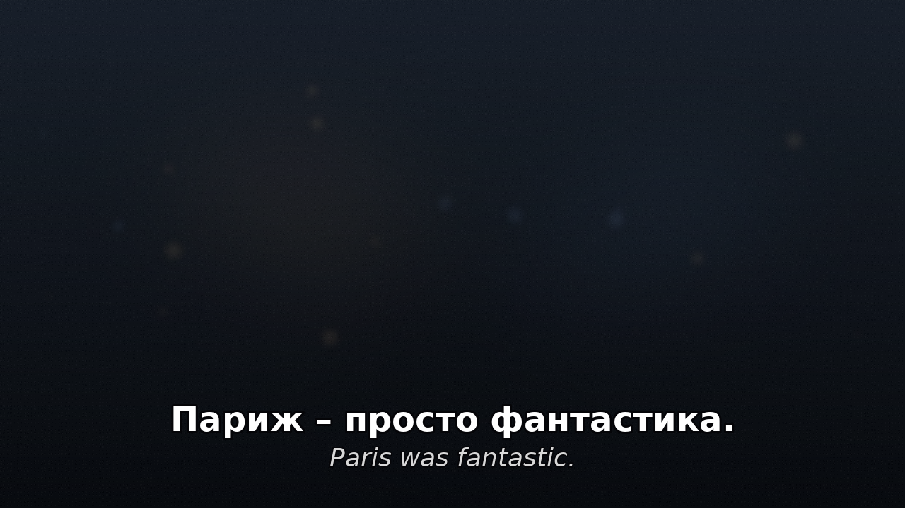
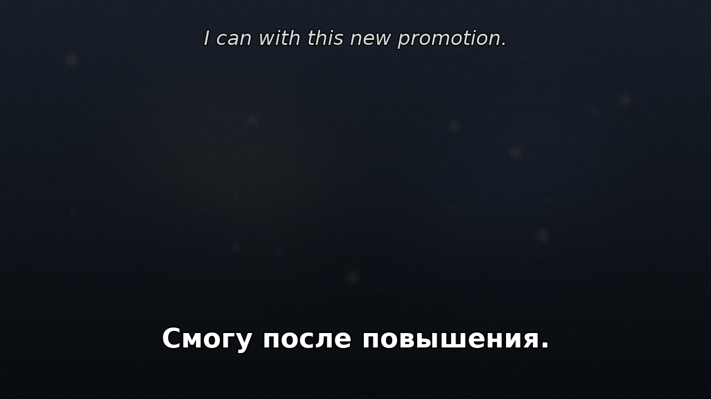

# KinoGloss

Merge two SRT subtitle files of different languages into a single bilingual
subtitle file (SRT or ASS) for language learning: the main language on top, the gloss language
beneath it in italics.

```
Wo ist der Bahnhof?
<i>Where is the train station?</i>
```

Subtitle files from different sources are often time-shifted relative to each
other. KinoGloss detects that offset automatically, keeps the two languages in
sync, and stamps the output with the timeline of whichever file you choose.

Requires Python 3.9+. No dependencies.

## Example output

Default: the study language on top, the smaller italic gloss beneath it
(`-o film.gloss.ass`):



With `--gloss-position top` the gloss moves to the top-center of the
screen, so you can try reading the main language first and glance up only
when needed:



Mock frames rendered with the same sizes and colors as the ASS output
(main white, gloss light gray at 75% size).

## Usage

```bash
python3 kinogloss.py MAIN.srt GLOSS.srt [options]
```

- `MAIN.srt` — the file whose text appears on top (usually the language you're learning)
- `GLOSS.srt` — the file whose text appears beneath, in italics

| Option | Meaning |
| --- | --- |
| `-o PATH` | Output file (default `MAIN.gloss.srt`; `-o -` prints to stdout) |
| `--timestamps {1,2}` | Which file provides the timestamps: `1` = main (default), `2` = gloss |
| `--offset MS` | Manual offset in milliseconds added to the non-timestamp file, instead of auto-detection. May be negative. |
| `--min-overlap FRACTION` | How much two cues must overlap (as a fraction of the shorter one) to be paired. Default `0.3`. |
| `--check` | Print a per-segment sync table (median residual over time). |
| `--format {srt,ass}` | Output format. Default: from the output file extension (`.ass` → ASS), else SRT. |
| `--gloss-position {below,top}` | Gloss below the main text (default) or top-center of the screen. |
| `--font-size PT` | Main text size for ASS output, on a 720p canvas. Default `48`. |
| `--gloss-scale FRACTION` | Gloss size relative to the main text, ASS output only. Default `0.75`. |

Example — German subtitles carry the timing, English gloss below, output next
to the German file:

```bash
python3 kinogloss.py film.de.srt film.en.srt
```

Example — the English file's timing matches your video, so take timestamps
from it instead:

```bash
python3 kinogloss.py film.de.srt film.en.srt --timestamps 2 -o film.bilingual.srt
```

## How syncing works

Every plausible pairing between a cue in one file and a cue in the other
proposes a time delta. The true offset appears as a dense cluster of
near-identical deltas; the densest candidate clusters are then verified by
shifting the cues and measuring how much of their duration actually lands on
a cue in the other file (in back-to-back dialogue nearly every offset
overlaps *something*, so overlap duration decides, not overlap count). The
winning offset is applied to the non-timestamp file before cues are matched
by overlap.

## Styling and layout

SRT (the default) is understood everywhere, but it has no reliable font-size
control — the gloss is set apart by italics only. For a smaller gloss, write
ASS instead, which most desktop players (VLC, mpv, MPC-HC, Kodi) render with
full styling:

```bash
python3 kinogloss.py film.de.srt film.en.srt -o film.gloss.ass --gloss-scale 0.6
```

In ASS output the gloss is smaller (default 75% of the main text), italic,
and light gray; `--font-size` sets the main size, `--gloss-scale` the ratio.

`--gloss-position top` moves the gloss to the top-center of the screen so it
doesn't compete with the dialogue line — useful if you want to try reading
the main language first and glance up only when needed. In ASS this uses a
proper style; in SRT it emits the gloss as a second simultaneous cue tagged
`{\an8}`, which VLC, mpv, and Kodi honor (players that don't will show it as
a normal extra cue at the bottom).

In top position, consecutive cues that would show the same gloss (see
fragment borrowing below) render as one event spanning them all: the
translation stays quietly on screen while the main cues change, instead of
re-rendering per cue. Repeats more than a second apart stay separate events.

## Sync verification

Every run ends with a sync verdict judged over the whole runtime, based on
the residual timing error of each matched cue pair after the global offset:

```
sync: in sync throughout (drift +0.1 ms/min)
```

The check distinguishes the ways two releases go out of sync:

- **Linear drift** (framerate mismatch, e.g. 23.976 vs 25 fps releases):
  residuals grow steadily; reported with the drift rate — and corrected
  automatically, see below.
- **Sync jump**: residuals step at one point, e.g. one release contains a
  recap or an extra scene. Reported with the size and location of the jump —
  and corrected automatically, see below.
- **Unmatched stretch**: a span where no cues pair at all — the releases
  differ structurally there.
- **Poor match rate**: when fewer than 60% of cues find a partner, residual
  analysis is unreliable and the verdict says so instead of guessing.

## Drift correction

When the sync check indicates drift (or too few cues match for a constant
offset to be plausible), KinoGloss fits a linear time map
`t_ref ≈ rate × t_other + offset` instead: local offsets are estimated in
windows across the runtime, a robust line is fitted through them, and the fit
is refined against actually matched cue pairs. The correction is applied only
if it matches more cues than the constant offset did, so it can never make
things worse. When the fitted rate matches a common framerate conversion, it
is named:

```
drift correction applied to non-timestamp file: rate ×0.959038 (-2458 ms/min, ≈ 23.976 → 25 fps), offset -10.77 s
```

## Sync-jump correction

TV releases often differ in where their commercial breaks or recaps sit, so
the right offset is a *different* constant in each stretch of the episode —
neither one offset nor a linear map fits. KinoGloss detects this by
estimating local offsets in windows across the runtime; the distinct offsets
found become candidates, and each cue is assigned the candidate that
maximizes its overlap with the other file (with a penalty per switch, so the
assignment stays piecewise instead of flickering). As with drift, the
correction is kept only if it pairs more cues than the constant offset did:

```
sync-jump correction applied to non-timestamp file, 3 segments:
  00:00:00–00:01:10  -164 ms  (28 cues)
  00:01:18–00:08:25  +1569 ms  (198 cues)
  00:08:29–00:20:54  +3785 ms  (295 cues)
```

Manual `--offset` disables all automatic correction. Jumps smaller than
about 0.6 s are treated as ordinary timing noise.

`--check` prints the evidence behind the verdict — a table of median
residuals per 10-minute segment:

```
segment      median residual   matched pairs
00:00–00:10           -10 ms              85
00:10–00:20            -5 ms              82
...
```

## When cue segmentation differs

The two files rarely split sentences into cues the same way. Where the
non-timestamp file is split finer, all its cues covering one timestamp-file
cue are joined with spaces. The opposite direction — one sentence spread
over *more* cues in the timestamp file — would leave the middle fragments
with no gloss, since each gloss cue attaches only to the cue it overlaps
most. Fragments like that borrow the gloss of every cue that overlaps them,
so the full translation stays visible (duplicated across the fragments
rather than misleadingly cut apart). Punctuation decides what counts as a
fragment: a cue that doesn't end a sentence, starts lowercase, ends in an
ellipsis, or follows an unfinished cue. Complete utterances the other file
simply skipped (interjections, sound descriptions) are left bare on purpose.
With `--gloss-position top`, the duplicated translation is shown as a single
event spanning the fragments instead of repeating.

Cues that exist in only one file (song lyrics, sound descriptions) are kept
without a gloss if they're in the timestamp file, and dropped otherwise; the
summary printed at the end counts both.

- Auto-detection searches offsets up to ±120 s; beyond that, pass `--offset`.
- Italic tags (`<i>…</i>`) are supported by VLC, mpv, Plex, Kodi, and most
  other players.

## Bazarr integration

Bazarr has no plugin API. Its extension point is the custom post-processing
command, which runs once for every subtitle Bazarr downloads. `bazarr_hook.py`
plugs KinoGloss into that:

- When a subtitle in a **study language** arrives (e.g. Russian), it becomes
  MAIN and the video's English track becomes GLOSS. That is an English sidecar
  (`<video>.en.srt`, else `.en.sdh.srt`), or failing that an embedded English
  text track pulled out with Bazarr's bundled ffmpeg. Forced tracks are never
  used as a gloss.
- When an **English** subtitle arrives, every study-language sidecar already
  next to the video is (re)glossed with it.
- Output is `<video stem>.<lang>.ass` next to the video, so Plex lists it under
  the study language, as "ASS" beside the plain "SRT" track. An existing `.ass`
  that KinoGloss did not write is left alone.

In Bazarr: *Settings → Subtitles → Post-Processing*, enable it, and set the
command to

```
D:\Arr\bazarr-python\python.exe D:\Projekte\KinoGloss\bazarr_hook.py {{episode}} {{subtitles}} {{subtitles_language_code2}}
```

The interpreter path must contain **no spaces and no quotes**. On Windows,
Bazarr splits the command with `shlex(posix=False)`, which keeps quotes
inside the arguments, so a quoted `"D:\Program Files\…\python.exe"` fails
with *Access denied*. `D:\Arr\bazarr-python` is a junction to Bazarr's own
WinPython (`D:\Program Files\Bazarr\WinPython\python-3.13.11.1`); recreate it
after a Bazarr update that changes the Python version:

```powershell
New-Item -ItemType Junction -Path D:\Arr\bazarr-python -Target "D:\Program Files\Bazarr\WinPython\python-3.13.11.1"
```

Settings (study languages, which file supplies the timing, ASS size and
position) can be overridden in `bazarr_hook.json` beside the script; see
`DEFAULTS` in `bazarr_hook.py`. The script writes its full report to
`bazarr_hook.log`, and Bazarr's log gets a one-line summary.

To gloss films that already have both subtitles, without Bazarr:

```bash
python3 bazarr_hook.py --backfill "/mnt/e/Medien/Kino" --dry-run
```

## Tests

```bash
python3 -m unittest test_kinogloss test_bazarr_hook -v
```
